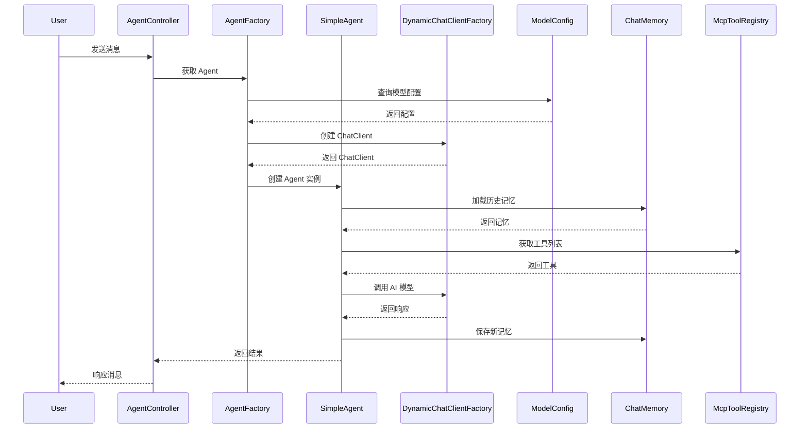
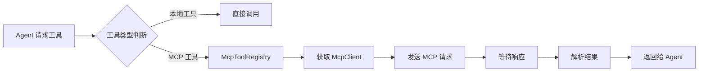
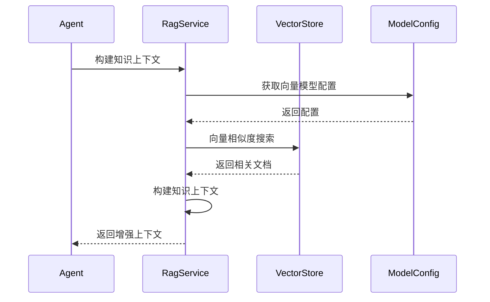

# 系统架构设计文档

## 1. 概述

### 1.1 文档目的

本文档详细描述 AI Agent 智能助手系统的整体架构设计，包括系统组成、模块划分、技术选型、数据流转等核心内容，为开发、测试、运维人员提供技术参考。

### 1.2 系统定位

AI Agent 是一个基于 Spring AI 和 Vue 3 构建的智能助手系统，提供：
- 智能对话服务
- 工具调用能力
- 知识库检索增强
- 多模型支持

### 1.3 设计原则

- **模块化**：高内聚低耦合，便于维护和扩展
- **可扩展**：支持水平扩展和垂直扩展
- **高可用**：服务健康检查、故障自动恢复
- **安全性**：敏感信息加密、权限控制
- **性能优化**：缓存策略、异步处理

## 2. 总体架构

### 2.1 架构分层

```
┌─────────────────────────────────────────┐
│         Presentation Layer              │
│         (Vue 3 + Element Plus)          │
└─────────────────┬───────────────────────┘
                  │ HTTP/REST
┌─────────────────▼───────────────────────┐
│         Application Layer               │
│      (Spring Boot + Spring AI)          │
└─────────────────┬───────────────────────┘
                  │
┌─────────────────▼───────────────────────┐
│         Domain Layer                    │
│    (Agent Core + Business Logic)        │
└─────────────────┬───────────────────────┘
                  │
┌─────────────────▼───────────────────────┐
│         Infrastructure Layer            │
│  (Database + Cache + Message Queue)     │
└─────────────────────────────────────────┘
```

### 2.2 物理架构

```
┌─────────────────────────────────────────────────────┐
│                    Client Side                      │
│  ┌──────────────────────────────────────────────┐  │
│  │           Browser / Web Client               │  │
│  └──────────────────┬───────────────────────────┘  │
└─────────────────────┼───────────────────────────────┘
                      │ HTTPS
┌─────────────────────▼───────────────────────────────┐
│                Nginx (Port 80)                      │
│         - Static File Server                        │
│         - Reverse Proxy                             │
└─────────────────────┬───────────────────────────────┘
                      │
┌─────────────────────▼───────────────────────────────┐
│          Spring Boot Backend (Port 8080)            │
│  ┌──────────────┐  ┌──────────────┐  ┌──────────┐ │
│  │  Controller  │  │   Service    │  │  Agent   │ │
│  └──────────────┘  └──────────────┘  └──────────┘ │
└─────────────────────┬───────────────────────────────┘
                      │
        ┌─────────────┼─────────────┐
        │             │             │
┌───────▼──────┐ ┌───▼──────┐ ┌───▼──────┐
│  PostgreSQL  │ │  Redis   │ │  Neo4j   │
│  (Primary)   │ │ (Cache)  │ │ (Graph)  │
└──────────────┘ └──────────┘ └──────────┘
        │
┌───────▼──────┐ ┌──────────┐
│   Milvus     │ │ RabbitMQ │
│  (Vector)    │ │  (MQ)    │
└──────────────┘ └──────────┘
```

## 3. 核心模块设计

### 3.1 Agent 核心模块

#### 3.1.1 Agent 层次结构

```
AbstractAgent (抽象基类)
    ├── SimpleAgent (简单对话 Agent)
    └── ReActAgent (推理 + 行动 Agent)
```

#### 3.1.2 Agent 执行流程



### 3.2 MCP 工具集成模块

#### 3.2.1 MCP 客户端架构

```
McpClientManager (客户端管理器)
    ├── StdioMcpClient (STDIO 协议)
    └── StreamableHttpMcpClient (HTTP 协议)
    
McpToolRegistry (工具注册中心)
    └── McpToolCallback (工具回调)
```

#### 3.2.2 工具调用流程



### 3.3 RAG 知识库模块

#### 3.3.1 知识库架构

```
RagService (RAG 服务)
    ├── DocumentProcessor (文档处理)
    ├── VectorStore (向量存储)
    └── KnowledgeRetriever (知识检索)
```

#### 3.3.2 检索增强流程



## 4. 数据架构

### 4.1 数据库设计

#### 4.1.1 核心表结构

**model_config** - 模型配置表
```sql
CREATE TABLE model_config (
    id BIGSERIAL PRIMARY KEY,
    model_name VARCHAR(100) NOT NULL,
    base_url VARCHAR(500),
    api_key VARCHAR(500),
    temperature DECIMAL(3,2),
    max_tokens INTEGER,
    created_at TIMESTAMP DEFAULT CURRENT_TIMESTAMP
);
```

**agent_config** - Agent 配置表
```sql
CREATE TABLE agent_config (
    id BIGSERIAL PRIMARY KEY,
    name VARCHAR(100) NOT NULL,
    model_config_id BIGINT REFERENCES model_config(id),
    system_prompt TEXT,
    enabled BOOLEAN DEFAULT true
);
```

**mcp_server** - MCP 服务器配置表
```sql
CREATE TABLE mcp_server (
    id BIGSERIAL PRIMARY KEY,
    name VARCHAR(100) NOT NULL,
    server_type VARCHAR(50),
    config JSONB,
    enabled BOOLEAN DEFAULT true
);
```

### 4.2 缓存策略

#### 4.2.1 Redis 缓存

- **会话缓存**：Chat Memory，TTL 24 小时
- **工具缓存**：MCP Tools，长期有效
- **配置缓存**：Model Config，长期有效

#### 4.2.2 缓存更新策略

```java
// 配置变更时更新缓存
@CacheEvict(value = "modelConfig", key = "#id")
public void updateConfig(Long id, ModelConfig config);

// 查询时加载缓存
@Cacheable(value = "modelConfig", key = "#id")
public ModelConfig getConfig(Long id);
```

## 5. 接口设计

### 5.1 REST API 规范

#### 5.1.1 统一响应格式

```json
{
  "code": 200,
  "message": "success",
  "data": {},
  "timestamp": 1234567890
}
```

#### 5.1.2 核心接口

**聊天接口**
```
POST /api/v1/agent/{id}/chat
Request:
{
  "message": "用户消息",
  "conversationId": "会话 ID"
}

Response:
{
  "message": "AI 响应",
  "toolCalls": [],
  "knowledgeContext": ""
}
```

**MCP 服务器管理**
```
GET    /api/v1/mcp/servers          # 列表
POST   /api/v1/mcp/servers          # 创建
PUT    /api/v1/mcp/servers/{id}     # 更新
DELETE /api/v1/mcp/servers/{id}     # 删除
POST   /api/v1/mcp/servers/{id}/reconnect  # 重连
```

## 6. 安全设计

### 6.1 认证授权

- API Key 认证
- JWT Token（可选）
- 基于角色的访问控制（RBAC）

### 6.2 数据安全

- 敏感配置环境变量化
- API 密钥加密存储
- SQL 注入防护
- XSS 攻击防护

### 6.3 网络安全

- HTTPS 传输
- CORS 配置
- 请求限流
- IP 白名单

## 7. 性能优化

### 7.1 数据库优化

- 索引优化
- 连接池配置
- 读写分离（可选）
- 分库分表（可选）

### 7.2 缓存优化

- 多级缓存策略
- 缓存预热
- 缓存失效策略

### 7.3 异步处理

- 消息队列解耦
- 异步任务处理
- 批量操作优化

## 8. 监控与日志

### 8.1 应用监控

- Spring Boot Actuator
- 健康检查端点
- 指标收集（Prometheus）

### 8.2 日志管理

- 结构化日志
- 日志级别控制
- 日志聚合（ELK）

### 8.3 链路追踪

- 请求 ID 追踪
- 性能分析
- 错误追踪

## 9. 部署架构

### 9.1 Docker 部署

```yaml
services:
  frontend:
    build: ./frontend
    ports:
      - "80:80"
  
  backend:
    build: ./backend
    ports:
      - "8080:8080"
    depends_on:
      - postgres
      - redis
      - neo4j
      - milvus
```

### 9.2 扩缩容策略

- 水平扩展：多实例部署
- 负载均衡：Nginx/K8s
- 数据库：主从复制

## 10. 未来规划

### 10.1 功能扩展

- 多 Agent 协作
- 工作流引擎
- 插件系统
- 可视化编排

### 10.2 技术升级

- K8s 容器编排
- Service Mesh
- 分布式追踪
- AI 模型微调

---

**文档版本**: v1.0  
**最后更新**: 2026-03-23  
**维护者**: AI Agent Team
