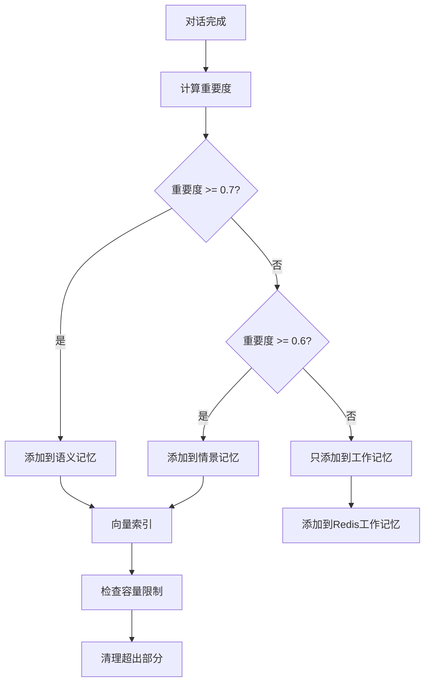
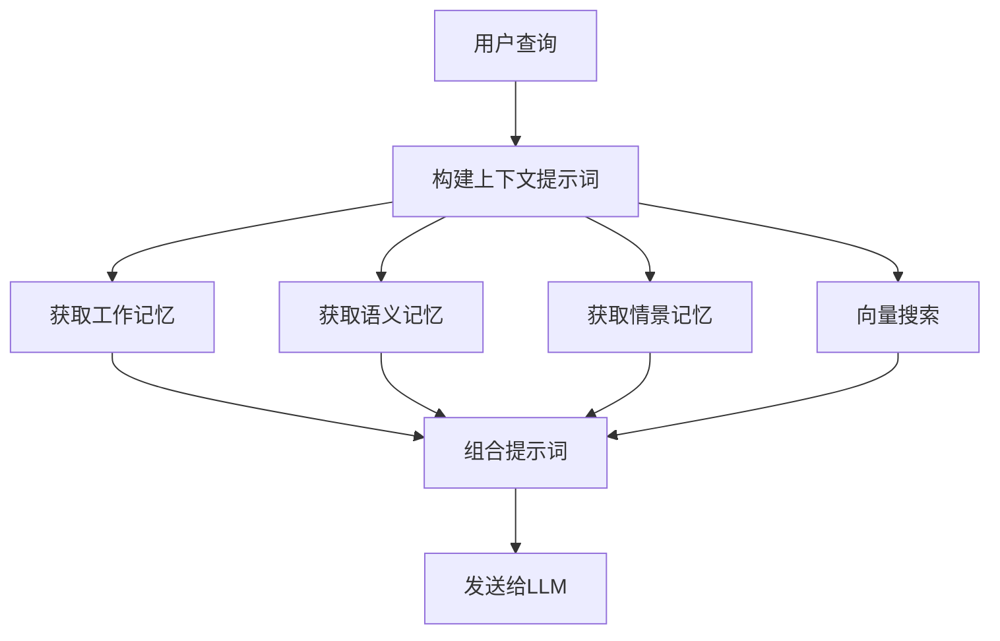

# 记忆系统文档

## 1. 系统架构

AI Agent 记忆系统采用分层架构设计，模拟人类记忆机制，实现不同时效和重要性的记忆管理。

### 1.1 记忆层次结构

| 层次 | 名称 | 存储位置 | 存储类型 | 最大容量 | 最小重要度 | 过期时间 | 用途 |
|------|------|---------|---------|----------|-----------|---------|------|
| 1 | 工作记忆 | Redis | 短期 | 会话内 | 无限制 | 会话结束 | 即时对话上下文 |
| 2 | 情景记忆 | PostgreSQL | 中期 | 100条/会话 | ≥ 0.6 | 30天 | 重要事件和对话 |
| 3 | 语义记忆 | PostgreSQL | 长期 | 500条/会话 | ≥ 0.7 | 永不过期 | 核心知识和规则 |

### 1.2 核心组件

- **MultiLayerMemoryManager**：记忆管理核心服务
- **MemoryImportanceCalculator**：记忆重要度评估
- **RedisWorkingMemoryService**：工作记忆存储
- **VectorSearchService**：向量相似度搜索
- **SessionMemoryMapper**：数据库操作

## 2. 工作原理

### 2.1 记忆添加流程



### 2.2 记忆检索流程



## 3. 核心算法

### 3.1 重要度评分算法

#### 3.1.1 LLM评分（首选方法）

- 使用大语言模型对内容重要性进行 1-10 分评分
- 评分标准：
  - 1-2分：日常闲聊、无意义内容
  - 3-4分：普通信息、轻度参考价值
  - 5-6分：有用信息、中等参考价值
  - 7-8分：重要信息、高参考价值
  - 9-10分：关键信息、核心知识、用户偏好/决定/问题
- 转换为 0.1-1.0 的 double 值

#### 3.1.2 降级算法（关键词匹配）

当 LLM 不可用时使用：

```java
score = 0.5  // 基础分

// 重要关键词加分（每个 +0.08）
重要关键词 = {"重要", "关键", "必须", "紧急", "记住", "不要", "偏好", 
             "决定", "选择", "我的", "我想", "我需要", "问题", "错误", "解决",
             "important", "critical", "must", "urgent", "remember", "user", "preference"}

// 内容长度加分
if (length > 100) score += 0.05
if (length > 200) score += 0.05

score = min(score, 1.0)
```

### 3.2 综合重要度排序算法

用于搜索时排序记忆，结合三个维度：

```java
combinedImportance = 0.4 × recency + 0.3 × importance + 0.3 × relevance

其中：
- recency（新鲜度）：基于指数衰减
  decayFactor = 0.995
  recency = pow(decayFactor, hoursSinceAccess)
  
- importance（重要度）：预计算的 0-1 值
  
- relevance（相关性）：基于关键词匹配
  relevance = min(1.0, matchCount / max(queryWords.length, 1))
```

### 3.3 记忆容量管理算法

当记忆超过上限时，智能清理策略：

1. 按重要度升序排序
2. 重要度相同时，按创建时间升序排序（旧的先删）
3. 删除最不重要的 N 条记忆
4. 同时从向量库中删除对应索引

### 3.4 向量索引算法

结合 Milvus 向量数据库：

1. 生成文本嵌入向量（embedding）
2. 索引到 Milvus，包含：
   - memoryId：记忆 ID
   - memoryType：记忆类型
   - sessionId：会话 ID
   - content：记忆内容
   - embedding：向量嵌入
3. 支持语义相似度搜索

## 4. 数据结构

### 4.1 记忆实体（SessionMemory）

| 字段 | 类型 | 描述 |
|------|------|------|
| id | Long | 主键（雪花算法） |
| sessionId | String | 会话 ID |
| memoryType | String | 类型（working/episodic/semantic/dialog） |
| layerLevel | Integer | 层次（1-4） |
| content | String | 记忆内容 |
| keywords | String | 关键词（逗号分隔） |
| importance | Double | 重要度（0-1） |
| createdAt | LocalDateTime | 创建时间 |
| accessedAt | LocalDateTime | 访问时间 |
| accessCount | Integer | 访问次数 |
| expiresAt | LocalDateTime | 过期时间 |
| metadata | String | 元数据 |
| summary | String | 摘要 |

### 4.2 记忆类型常量

| 常量 | 值 | 描述 |
|------|------|------|
| LAYER_DIALOG | 1 | 对话层 |
| LAYER_WORKING | 2 | 工作记忆层 |
| LAYER_EPISODIC | 3 | 情景记忆层 |
| LAYER_SEMANTIC | 4 | 语义记忆层 |
| TYPE_WORKING | "working" | 工作记忆 |
| TYPE_EPISODIC | "episodic" | 情景记忆 |
| TYPE_SEMANTIC | "semantic" | 语义记忆 |
| TYPE_DIALOG | "dialog" | 对话记忆 |

## 5. API 接口

### 5.1 记忆管理接口

| 接口 | 方法 | 路径 | 描述 |
|------|------|------|------|
| 获取所有记忆 | GET | /api/v1/memory/session | 获取会话的所有记忆 |
| 获取工作记忆 | GET | /api/v1/memory/session/working | 获取工作记忆 |
| 获取情景记忆 | GET | /api/v1/memory/session/episodic | 获取情景记忆 |
| 获取语义记忆 | GET | /api/v1/memory/session/semantic | 获取语义记忆 |
| 获取重要记忆 | GET | /api/v1/memory/session/important | 获取重要记忆 |
| 搜索记忆 | GET | /api/v1/memory/session/search | 搜索记忆 |
| 获取最近记忆 | GET | /api/v1/memory/session/recent | 获取最近记忆 |
| 删除记忆 | DELETE | /api/v1/memory/session/{id} | 删除指定记忆 |
| 清空工作记忆 | DELETE | /api/v1/memory/session/working/clear | 清空工作记忆 |
| 清空情景记忆 | DELETE | /api/v1/memory/session/episodic/clear | 清空情景记忆 |
| 清空语义记忆 | DELETE | /api/v1/memory/session/semantic/clear | 清空语义记忆 |
| 清空所有记忆 | DELETE | /api/v1/memory/session/clear | 清空所有记忆 |
| 获取记忆统计 | GET | /api/v1/memory/session/stats | 获取记忆统计信息 |

## 6. 配置项

| 配置项 | 默认值 | 描述 |
|------|------|------|
| EPISODIC_MAX_SIZE | 100 | 情景记忆最大数量 |
| SEMANTIC_MAX_SIZE | 500 | 语义记忆最大数量 |
| EPISODIC_MIN_IMPORTANCE | 0.6 | 情景记忆最小重要度 |
| SEMANTIC_MIN_IMPORTANCE | 0.7 | 语义记忆最小重要度 |
| EPISODIC_MAX_AGE_DAYS | 30 | 情景记忆最大保存天数 |

## 7. 定时任务

- **执行时间**：每天凌晨 3 点（`@Scheduled(cron = "0 0 3 * * ?")`）
- **任务**：清理过期的情景记忆（30天过期）

## 8. 性能优化

1. **分层存储**：不同时效的记忆分开管理
2. **Redis 缓存**：工作记忆使用 Redis 提高性能
3. **向量索引**：语义搜索使用 Milvus 向量库
4. **批量操作**：数据库操作批量执行
5. **容量限制**：自动清理低质量记忆

## 9. 错误处理

1. **LLM 失败降级**：当 LLM 评分失败时，自动使用规则降级算法
2. **向量索引失败**：索引失败时记录日志，不影响主流程
3. **数据库异常**：捕获异常，确保服务稳定性

## 10. 最佳实践

1. **会话管理**：为每个用户或对话创建独立的 sessionId
2. **记忆质量**：优先添加高质量、结构化的内容
3. **关键词提取**：使用 LLM 提取准确的关键词
4. **定期清理**：定期检查和清理过期记忆
5. **监控统计**：关注记忆数量和质量的变化

## 11. 代码结构

```
backend/src/main/java/com/wk/agent/
├── service/
│   ├── MultiLayerMemoryManager.java        # 记忆管理接口
│   ├── MemoryImportanceCalculator.java      # 重要度计算
│   ├── impl/
│   │   └── MultiLayerMemoryManagerImpl.java # 记忆管理实现
├── entity/
│   └── SessionMemory.java                  # 记忆实体
├── mapper/
│   └── SessionMemoryMapper.java            # 数据库操作
├── controller/
│   └── MemoryController.java               # 记忆 API 控制器
└── service/
    ├── RedisWorkingMemoryService.java      # Redis 工作记忆服务
    └── VectorSearchService.java            # 向量搜索服务
```

## 12. 示例代码

### 12.1 添加记忆

```java
// 添加工作记忆
multiLayerMemoryManager.addWorkingMemory(sessionId, "用户询问关于记忆系统的实现", 0.5);

// 添加情景记忆
multiLayerMemoryManager.addEpisodicMemory(sessionId, "用户讨论了记忆系统的架构", 0.7, "记忆系统,架构,实现");

// 添加语义记忆
multiLayerMemoryManager.addSemanticMemory(sessionId, "记忆系统包含工作记忆、情景记忆和语义记忆三个层次", 0.85, "记忆系统,层次,架构");
```

### 12.2 构建上下文

```java
String context = multiLayerMemoryManager.buildContextPrompt(sessionId, "记忆系统如何工作？");
// 结果：
// 请参考以下记忆上下文回答用户问题：
// 
// 【知识】
// 1. 记忆系统包含工作记忆、情景记忆和语义记忆三个层次 [记忆系统,层次,架构]
// 
// 【相关事件】
// 1. 用户讨论了记忆系统的架构 [2026-03-23]
// 
// 【当前上下文】
// • 用户询问关于记忆系统的实现
```

### 12.3 搜索记忆

```java
List<SessionMemory> results = multiLayerMemoryManager.searchMemories(sessionId, "记忆系统");
// 按综合重要度排序返回相关记忆
```

## 13. 监控与维护

1. **记忆统计**：通过 `/api/v1/memory/session/stats` 查看记忆数量
2. **记忆质量**：关注重要度分布，确保高质量记忆占比
3. **性能监控**：监控 Redis 和数据库操作性能
4. **容量管理**：定期检查记忆容量，确保系统稳定

## 14. 未来优化方向

1. **记忆压缩**：对长期记忆进行自动摘要和压缩
2. **记忆融合**：相似记忆的自动合并
3. **多模态记忆**：支持图像、音频等多模态记忆
4. **个性化记忆**：基于用户特征的个性化记忆管理
5. **记忆预测**：预测用户可能需要的记忆

---

此文档详细说明了 AI Agent 记忆系统的设计原理、实现细节和使用方法，为开发和维护提供参考。