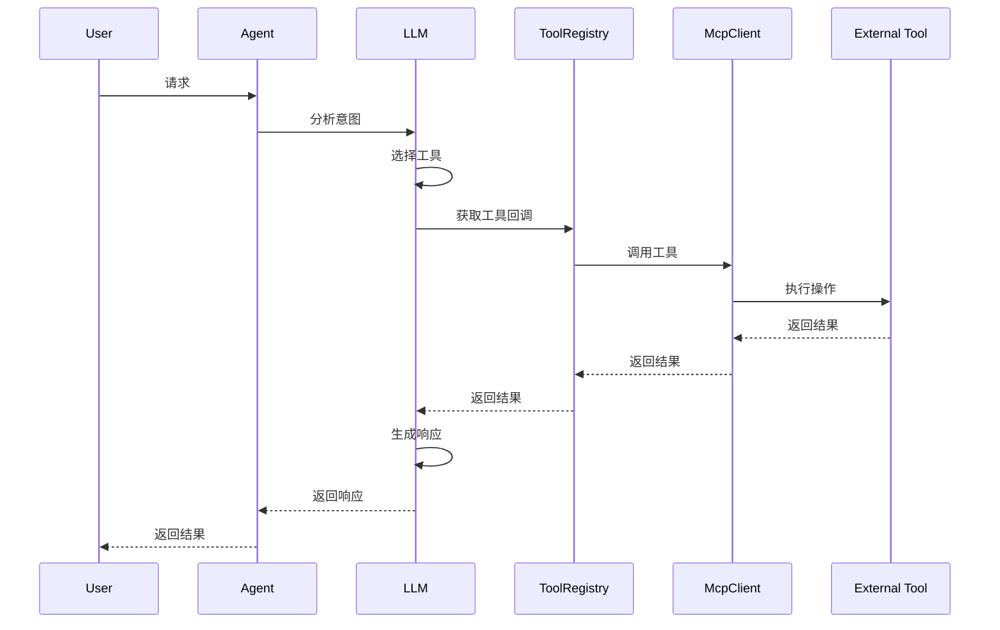

# MCP 工具集成文档

## 1. 概述

### 1.1 什么是 MCP

MCP（Model Context Protocol）是一个开放协议，用于标准化 AI 模型与外部工具和数据源的交互方式。它提供了一种统一的方式让 AI 模型能够调用各种工具、访问数据源。

### 1.2 MCP 架构

```
┌─────────────────┐
│   AI Model      │
│  (LLM/Agent)    │
└────────┬────────┘
         │
┌────────▼────────┐
│  MCP Client     │
│  (本协议实现)   │
└────────┬────────┘
         │ MCP Protocol
┌────────▼────────┐
│  MCP Server     │
│  (工具提供者)   │
└────────┬────────┘
         │
┌────────▼────────┐
│  External Tool  │
│  (实际功能)     │
└─────────────────┘
```

### 1.3 传输方式

系统支持两种 MCP 传输方式：

#### STDIO（标准输入输出）
- **适用场景**: 本地工具、命令行工具
- **优点**: 低延迟、简单安全
- **缺点**: 仅限本地、单客户端

#### Streamable HTTP
- **适用场景**: 远程服务、Web 服务
- **优点**: 远程访问、多客户端、可扩展
- **缺点**: 网络延迟、需要 HTTP 服务

## 2. 系统实现

### 2.1 核心组件

#### McpClientManager
```java
@Component
public class McpClientManager {
    
    // 客户端管理
    private final Map<Long, McpClient> clients = new ConcurrentHashMap<>();
    
    // 获取或初始化客户端
    public McpClient getOrInitializeClient(McpServer server)
    
    // 重新连接
    public void reconnectClient(Long serverId)
    
    // 销毁客户端
    public void destroyClient(Long serverId)
}
```

#### McpToolRegistry
```java
@Component
public class McpToolRegistry {
    
    // 工具注册
    public void registerTool(Long serverId, Tool tool, McpClient client)
    
    // 获取工具
    public List<ToolCallback> getToolCallbacksForServers(List<Long> serverIds)
    
    // 工具调用
    public ToolCallback getTool(String toolKey)
}
```

### 2.2 客户端实现

#### StdioMcpClient（STDIO 协议）

**连接流程**:
```java
public void connect() {
    // 1. 启动子进程
    process = new ProcessBuilder(command, args)
        .redirectErrorStream(true)
        .start();
    
    // 2. 获取输入输出流
    reader = new BufferedReader(
        new InputStreamReader(process.getInputStream())
    );
    writer = new PrintWriter(process.getOutputStream());
    
    // 3. 初始化 MCP 会话
    initialize();
    
    // 4. 获取工具列表
    listTools();
}
```

**工具调用流程**:
```java
public JsonNode callTool(String toolName, Map<String, Object> arguments) {
    // 1. 构建 JSON-RPC 请求
    JsonObject request = buildRequest(toolName, arguments);
    
    // 2. 发送请求
    sendRequest(request);
    
    // 3. 等待响应
    return waitForResponse();
}
```

#### StreamableHttpMcpClient（HTTP 协议）

**连接流程**:
```java
public void connect() {
    // 1. 初始化会话
    initialize();
    
    // 2. 获取工具列表
    listTools();
}
```

**工具调用流程**:
```java
public JsonNode callTool(String toolName, Map<String, Object> arguments) {
    // 1. 构建请求体
    JsonObject requestBody = buildRequestBody(toolName, arguments);
    
    // 2. 发送 HTTP POST
    HttpResponse response = httpClient.post(url, requestBody);
    
    // 3. 解析响应
    return parseResponse(response);
}
```

## 3. 工具配置

### 3.1 添加 MCP 服务器

#### 方式一：通过管理界面

1. 访问 MCP 服务器管理页面
2. 点击"添加服务器"
3. 填写配置信息：
   - 名称：服务器名称
   - 类型：stdio 或 streamable
   - 配置：JSON 格式配置
4. 保存并测试连接

#### 方式二：通过数据库

```sql
INSERT INTO mcp_server (name, server_type, config, enabled)
VALUES (
    'my-tool',
    'stdio',
    '{"command": "npx", "args": ["-y", "@mcp/my-tool"]}',
    true
);
```

### 3.2 配置示例

#### STDIO 工具配置

**必应搜索**:
```json
{
  "command": "npx",
  "args": ["-y", "mcp-server-bing-search"]
}
```

**网页抓取**:
```json
{
  "command": "npx",
  "args": ["-y", "@modelcontextprotocol/server-fetch"]
}
```

**文件系统**:
```json
{
  "command": "npx",
  "args": ["-y", "@modelcontextprotocol/server-filesystem", "/path/to/files"]
}
```

#### HTTP 工具配置

**远程服务**:
```json
{
  "url": "http://localhost:8000/mcp",
  "headers": {
    "Authorization": "Bearer token"
  }
}
```

## 4. 工具使用

### 4.1 Agent 中使用工具

#### 配置 Agent 关联工具

```java
// 1. 查询 MCP 服务器
List<McpServer> servers = mcpServerService.listEnabledServers();
List<Long> serverIds = servers.stream()
    .map(McpServer::getId)
    .collect(Collectors.toList());

// 2. 获取工具回调
List<ToolCallback> toolCallbacks = mcpToolRegistry
    .getToolCallbacksForServers(serverIds);

// 3. 创建 Agent 时关联工具
AbstractAgent agent = new SimpleAgent(
    config,
    chatClient,
    chatMemory,
    ragService,
    toolCallbacks  // 关联的工具
);
```

#### 工具调用流程



### 4.2 工具描述生成

LLM 通过工具描述了解工具功能：

```java
protected String getToolDescriptions() {
    return getAvailableTools().stream()
        .map(tool -> {
            ToolDefinition def = tool.getToolDefinition();
            return String.format(
                "工具名称：%s\n描述：%s\n参数：%s",
                def.getName(),
                def.getDescription(),
                def.getInputSchema()
            );
        })
        .collect(Collectors.joining("\n\n"));
}
```

## 5. 开发 MCP 工具

### 5.1 Python MCP 工具示例

```python
from mcp.server.fastmcp import FastMCP

# 创建 MCP 服务器
mcp = FastMCP("My Tool Server")

@mcp.tool()
def search_web(query: str, max_results: int = 10) -> dict:
    """
    搜索网络信息
    
    Args:
        query: 搜索关键词
        max_results: 最大结果数
    """
    # 实现搜索逻辑
    results = perform_search(query, max_results)
    return {
        "query": query,
        "results": results
    }

@mcp.tool()
def calculate(expression: str) -> float:
    """
    计算数学表达式
    
    Args:
        expression: 数学表达式，如 "2 + 2 * 3"
    """
    return eval(expression)

if __name__ == "__main__":
    # 启动服务器
    mcp.run(transport="stdio")
```

### 5.2 TypeScript MCP 工具示例

```typescript
import { Server } from '@modelcontextprotocol/sdk/server/index.js';
import { StdioServerTransport } from '@modelcontextprotocol/sdk/server/stdio.js';

// 创建服务器
const server = new Server({
  name: 'my-tool-server',
  version: '1.0.0'
}, {
  capabilities: {
    tools: {}
  }
});

// 注册工具
server.setRequestHandler('tools/list', async () => {
  return {
    tools: [{
      name: 'search_web',
      description: '搜索网络信息',
      inputSchema: {
        type: 'object',
        properties: {
          query: { type: 'string' },
          max_results: { type: 'number' }
        },
        required: ['query']
      }
    }]
  };
});

// 处理工具调用
server.setRequestHandler('tools/call', async (request) => {
  const { name, arguments: args } = request.params;
  
  if (name === 'search_web') {
    const results = await performSearch(args.query, args.max_results);
    return {
      content: [{
        type: 'text',
        text: JSON.stringify(results, null, 2)
      }]
    };
  }
  
  throw new Error(`Unknown tool: ${name}`);
});

// 启动服务器
async function main() {
  const transport = new StdioServerTransport();
  await server.connect(transport);
}

main();
```

## 6. 调试指南

### 6.1 查看日志

```bash
# 查看后端日志
docker-compose logs -f backend

# 过滤 MCP 相关日志
docker-compose logs -f backend | grep -i mcp
```

### 6.2 测试工具连接

```bash
# 手动测试 STDIO 工具
echo '{"jsonrpc":"2.0","method":"initialize","params":{},"id":1}' | \
  npx -y @mcp/my-tool
```

### 6.3 常见问题

#### 问题 1: 工具列表为空

**原因**:
- MCP 服务器未启动
- 配置错误
- 连接超时

**解决方案**:
1. 检查服务器配置
2. 查看日志错误信息
3. 手动测试工具

#### 问题 2: 工具调用失败

**原因**:
- 参数不匹配
- 工具实现错误
- 网络问题

**解决方案**:
1. 检查参数格式
2. 查看工具日志
3. 测试工具独立运行

#### 问题 3: 连接超时

**原因**:
- npx 下载慢
- 网络问题
- 资源不足

**解决方案**:
1. 增加超时时间
2. 预下载依赖
3. 检查系统资源

## 7. 最佳实践

### 7.1 工具设计原则

1. **单一职责**: 每个工具只做一件事
2. **明确描述**: 清晰的名称和描述
3. **参数验证**: 严格的参数验证
4. **错误处理**: 完善的错误处理
5. **性能优化**: 快速响应

### 7.2 安全考虑

1. **权限控制**: 限制工具访问权限
2. **输入验证**: 验证所有输入
3. **输出过滤**: 过滤敏感信息
4. **资源限制**: 限制资源使用
5. **审计日志**: 记录工具调用

### 7.3 性能优化

1. **连接池**: 复用连接
2. **缓存**: 缓存常用结果
3. **超时**: 设置合理超时
4. **并发**: 支持并发调用
5. **监控**: 性能监控

## 8. 扩展开发

### 8.1 添加新传输协议

实现 `McpClient` 接口：

```java
public class CustomMcpClient implements McpClient {
    
    @Override
    public void connect() {
        // 实现连接逻辑
    }
    
    @Override
    public JsonNode callTool(String toolName, Map<String, Object> arguments) {
        // 实现工具调用
    }
    
    @Override
    public void close() {
        // 实现关闭逻辑
    }
}
```

### 8.2 自定义工具注册

```java
@Component
public class CustomToolRegistrar {
    
    @PostConstruct
    public void registerCustomTools() {
        // 注册自定义工具
        ToolCallback customTool = createCustomTool();
        mcpToolRegistry.registerTool(
            -1L,  // 本地工具
            customTool.getToolDefinition(),
            customTool
        );
    }
}
```

## 9. 参考资料

- [MCP 官方文档](https://modelcontextprotocol.io/)
- [MCP SDK](https://github.com/modelcontextprotocol/sdk)
- [MCP 示例服务器](https://github.com/modelcontextprotocol/servers)

---

**文档版本**: v1.0  
**最后更新**: 2026-03-23  
**维护者**: AI Agent Team
